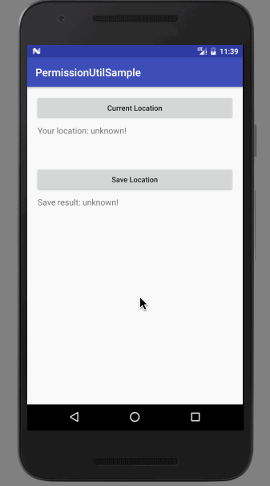
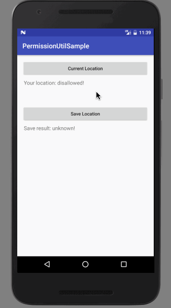
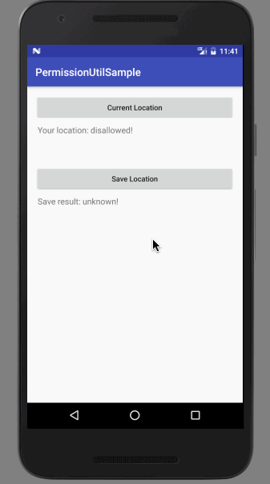
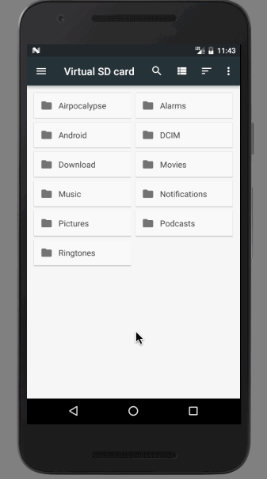

# Android PermissionUtil

A wrapper for android terrible native permission request api.

## Note

none.

core code: [PermissionUtil.java](./PermissionUtil/permission-util/src/main/java/com/baurine/permissionutil/PermissionUtil.java)

## Samples

1. Deny permission at the first time

   

1. Deny at the second time and jump to system setting, but do nothing

   

1. Deny at the third time and jump to system setting, change setting to allow the permission

   

1. Deny at the frist time and allow directly at the second time

   

## Getting Started

### Step 1 - Add the JitPack repository to your root `build.gradle` at the end of repositories:

    allprojects {
      repositories {
        ...
        maven { url 'https://jitpack.io' }
      }
    }

### Step 2 - Add the dependency in your app `build.gradle`:

    dependencies {
      compile 'com.github.baurine:permission-util:${latest-version}'
    }

`latest-version`: see top JitPack badge

## Usage

### Step 1 - Override BaseActivity `onRequestPermissionsResult()` and `onActivityResult()`

In your android project, you must be or should have a BaseActivity as base class of other activities. 
Override its `onRequestPermissionsResult()` and `onActivityResult()` methods, let PermissionUtil to handle them.

    public class BaseActivity extends AppCompatActivity {

        @Override
        public void onRequestPermissionsResult(int requestCode,
                                              @NonNull String[] permissions,
                                              @NonNull int[] grantResults) {
            PermissionUtil.onRequestPermissionResult(this, requestCode, permissions, grantResults);
        }

        @Override
        protected void onActivityResult(int requestCode, int resultCode, Intent data) {
            PermissionUtil.onActivityResult(this, requestCode);
        }
    }

### Step 2 - Optional, write a helper util to wrap PermissionUtil to not make code mess

    public class CheckPermissionUtil {

        private static final int LOCATION_PERMISSION_REQ_CODE = 200;
        private static final int WRITE_SD_REQ_CODE = 201;

        public static void checkLocation(Activity activity,
                                        PermissionUtil.ReqPermissionCallback callback) {
            PermissionUtil.checkPermission(activity,
                    Manifest.permission.ACCESS_FINE_LOCATION,
                    LOCATION_PERMISSION_REQ_CODE,
                    "We need location permission to locate your position",
                    "We can't get your location without location permission",
                    callback);
        }

        public static void checkWriteSd(Activity activity,
                                        PermissionUtil.ReqPermissionCallback callback) {
            PermissionUtil.checkPermission(activity,
                    Manifest.permission.WRITE_EXTERNAL_STORAGE,
                    WRITE_SD_REQ_CODE,
                    "We need write external storage permission to save your location to file",
                    "We can't save your location to file without storage permission",
                    callback);
        }
    }

### Step 3 - Call `PermissionUtil.checkPermission()` anywhere and receive result in its callback

    // MainActivity.java
    public void onClick(View view) {
        switch (view.getId()) {
            ...
            case R.id.btn_save_location:
                saveLocation();
                break;
        }
    }

    private void saveLocation() {
        CheckPermissionUtil.checkWriteSd(this,
                new PermissionUtil.ReqPermissionCallback() {
                    @Override
                    public void onResult(boolean success) {
                        if (success) {
                            saveLocationToFile();
                        } else {
                            showSaveResult("disallowed!");
                        }
                    }
                });
    }

License
-------

    Copyright 2017 baurine.

    Licensed under the Apache License, Version 2.0 (the "License");
    you may not use this file except in compliance with the License.
    You may obtain a copy of the License at

       http://www.apache.org/licenses/LICENSE-2.0

    Unless required by applicable law or agreed to in writing, software
    distributed under the License is distributed on an "AS IS" BASIS,
    WITHOUT WARRANTIES OR CONDITIONS OF ANY KIND, either express or implied.
    See the License for the specific language governing permissions and
    limitations under the License.
